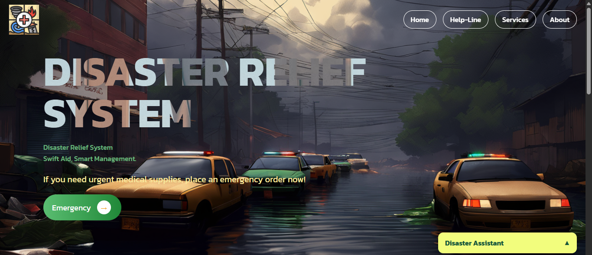

# Disaster Relief System 🚨

 <!-- Add your banner image if available -->

A React-based emergency management system connecting users with critical medical supplies during disasters.

## 🌟 Features

- **Emergency Supply Ordering**
  - Request medical kits and supplies
  - Real-time status tracking
- **Disaster Preparedness Guides**
  - Earthquake, flood, fire protocols
  - Interactive precaution checklists
- **Multi-channel Alerts**
  - SMS/email notifications
  - Location-based emergency contacts
- **Admin Dashboard**
  - Inventory management
  - Request monitoring

## 🛠️ Tech Stack

**Frontend:**
- React 18 + Vite
- React Router 6
- Supabase JS
- SweetAlert2
- CSS framework

**Backend:**
- Supabase (PostgreSQL)

## 🚀 Deployment

Deployed on Vercel:  
[

## 🖥️ Local Development

1. **Clone the repository**
   ```bash
   git clone https://github.com/anusha-fatima/Disaster-Relief-System.git
   cd Disaster-Relief-System
